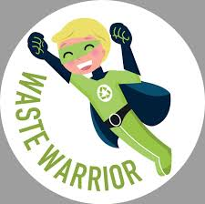

<div align="center">
  
  
  # ♻️ Waste Warrior
  
  **Building cleaner communities together through smart waste management, gamification, and real-time tracking.**
  
  ### 🚀 Built for Smart India Hackathon 2025 (SIH 2025)

  [](https://react.dev/)
  [](https://vitejs.dev/)
  [](https://supabase.com/)
  [](https://tailwindcss.com/)
  [](LICENSE)

  [View Demo](#) · [Report Bug](issues) · [Request Feature](issues)
</div>

---

## 📖 About The Project

**Waste Warrior** is a comprehensive digital ecosystem designed to revolutionize urban waste management. Created for **SIH 2025**, this platform connects Residents and Waste Workers with Administrators to make recycling efficient, rewarding, and transparent.

The core philosophy is **Gamification**: We turn the mundane task of waste segregation into a rewarding experience where users earn "Green Points," unlock badges, and compete on community leaderboards.

### 🌟 Key Features

#### 🏠 For Residents
* **Smart Reporting:** Report waste issues with geo-tagged photos and AI-assisted categorization.
* **Gamified Learning:** Interactive modules with quizzes to learn about waste segregation.
* **Rewards System:** Earn 'Green Points' for every verified action and redeem them for real-world benefits.
* **Impact Tracking:** Visual dashboard to see your personal contribution to the environment.

#### 👷 For Waste Workers
* **Task Management:** View assigned pickups and optimize daily routes.
* **Verification:** Verify waste segregation at the source and approve/reject reports.
* **Progress Tracking:** Track daily completions and earnings.

#### 🧑‍💼 For Administrators
* **System Oversight:** Monitor overall system health and user activities.
* **User Management:** Manage resident and worker accounts.
* **Analytics:** View reports and analytics on waste collection and recycling.

---

## 📸 Screenshots

| **Interactive Dashboard** | **Gamified Learning** |
|:---:|:---:|
|  |  |
| *Real-time stats and quick actions* | *Video modules and quizzes* |

| **Leaderboard** | **Impact Tracking** |
|:---:|:---:|
|  |  |
| *Compete with neighbors* | *Before & After gallery* |

---

## 🛠️ Tech Stack

This project is built using the latest web technologies for performance and scalability.

* **Frontend Framework:** [React.js](https://reactjs.org/) with [TypeScript](https://www.typescriptlang.org/)
* **Build Tool:** [Vite](https://vitejs.dev/)
* **Styling:** [Tailwind CSS](https://tailwindcss.com/)
* **UI Components:** [ShadCN UI](https://ui.shadcn.com/) & [Radix UI](https://www.radix-ui.com/)
* **Animations:** [Framer Motion](https://www.framer.com/motion/) (for smooth transitions and gamification effects)
* **Backend & Auth:** [Supabase](https://supabase.com/) (PostgreSQL, Authentication, Storage, Realtime)
* **State Management:** React Query (TanStack Query)
* **Maps:** Map Integration for location tracking
* **Internationalization:** `react-i18next` (Multi-language support)

---

## 🚀 Getting Started

Follow these instructions to set up the project locally on your machine.

### Prerequisites

* Node.js (v16 or higher)
* npm or bun

### Installation

1.  **Clone the repository**
    ```bash
    git clone [https://github.com/manavmerja/Waste-Warrior.git](https://github.com/manavmerja/Waste-Warrior.git)
    cd Waste-Warrior
    ```

2.  **Install dependencies**
    ```bash
    npm install
    # or
    bun install
    ```

3.  **Configure Environment Variables**
    * Create a `.env` file in the root directory.
    * Copy the contents from `.env.example` (if available) or add your Supabase credentials:
    ```env
    VITE_SUPABASE_URL=your_supabase_project_url
    VITE_SUPABASE_ANON_KEY=your_supabase_anon_key
    ```

4.  **Start the Development Server**
    ```bash
    npm run dev
    ```

5.  Open `http://localhost:5173` in your browser.

---

## 🤝 How to Contribute

We welcome contributions from the open-source community! Whether it's fixing a bug, adding a feature, or improving documentation.

1.  **Fork the Project** (Click the 'Fork' button at the top right)
2.  **Create your Feature Branch** (`git checkout -b feature/AmazingFeature`)
3.  **Commit your Changes** (`git commit -m 'Add some AmazingFeature'`)
4.  **Push to the Branch** (`git push origin feature/AmazingFeature`)
5.  **Open a Pull Request**

---

## 🛡️ Security

If you discover a security vulnerability within this project, please send an e-mail to the project maintainer instead of creating a public issue.

---

## 👥 Team & Contributors

This project is the result of hard work and collaboration for **Smart India Hackathon 2025**.

### 🌟 Core Team

| Name | Role | GitHub |
| :--- | :--- | :--- |
| **Manav Merja** | **👑 Project Lead & Full Stack Developer**<br>*(Architecture, Backend, Frontend, API)* | [Profile](https://github.com/manavmerja) |
| **Bhargav Rakhodiya**| **Frontend Developer**<br>*(UI Implementation & Design)* | [Profile](https://github.com/bhargavrakholiya123) |
| **Ayaan Mansuri** | **Security Analyst & Developer**<br>*(App Security, Bug Fixes & Testing)* | [Profile](https://github.com/artemis-rv) |
| **Gunja Bhatt** | **Junior Developer**<br>*(Backend Support & Localization)* | [Profile](https://github.com/gunjaa122006) |

### 🤝 Contributors & Support

| Name | Contribution | GitHub |
| :--- | :--- | :--- |
| **Harsh Joshi** | **Team Member**<br>*(Documentation & Research)* | [Profile](https://github.com/harsh-joshi1234-hb) |
| **Param Vadhadiya** | **Team Member**<br>*(Testing & Analysis)* | [Profile](https://github.com/Paramvadhadiya500) |

### 🌟 Project Mentor
* **Nilesh Dubey** - *Guidance & Technical Strategy*

---

## 📄 License

Distributed under the MIT License. See `LICENSE` for more information.

<div align="center">
  <br />
  <i>Let's make our planet cleaner, one step at a time! 🌍</i>
</div>